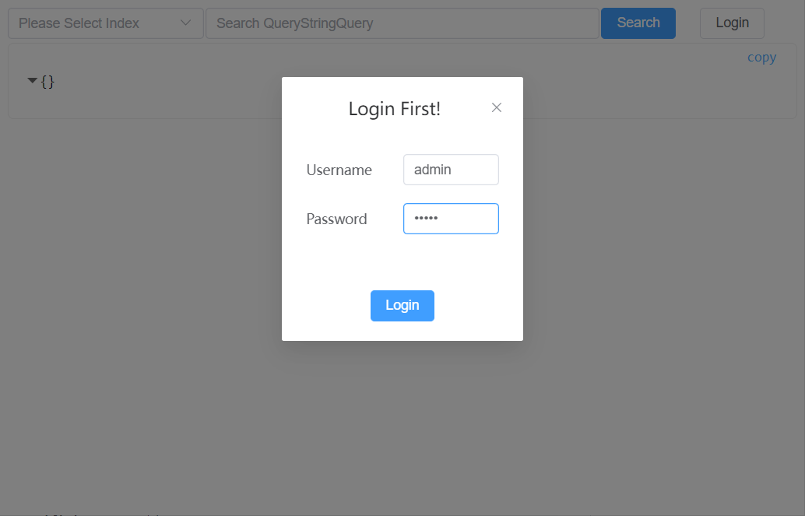
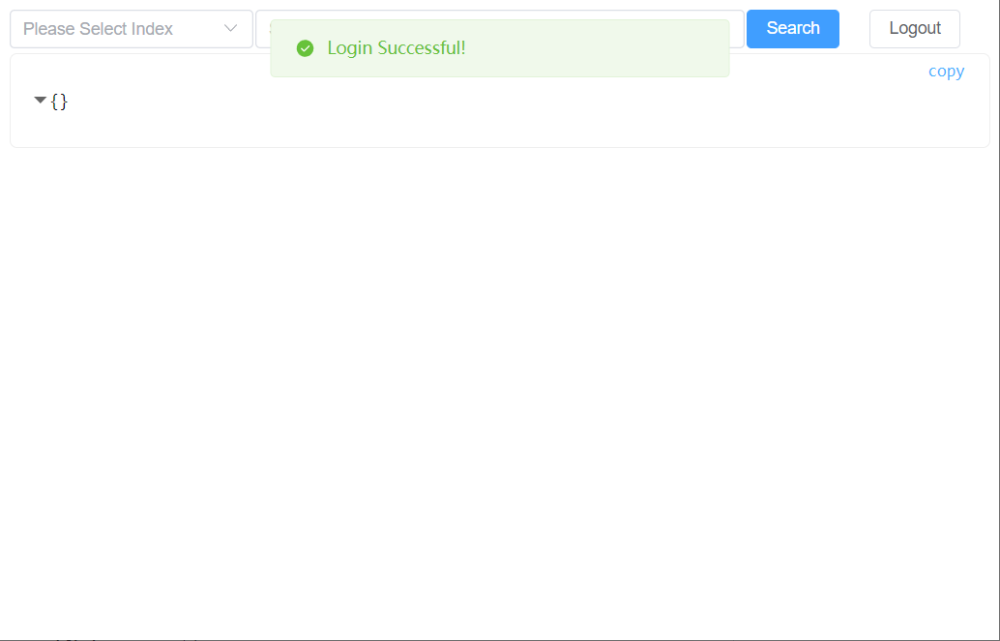
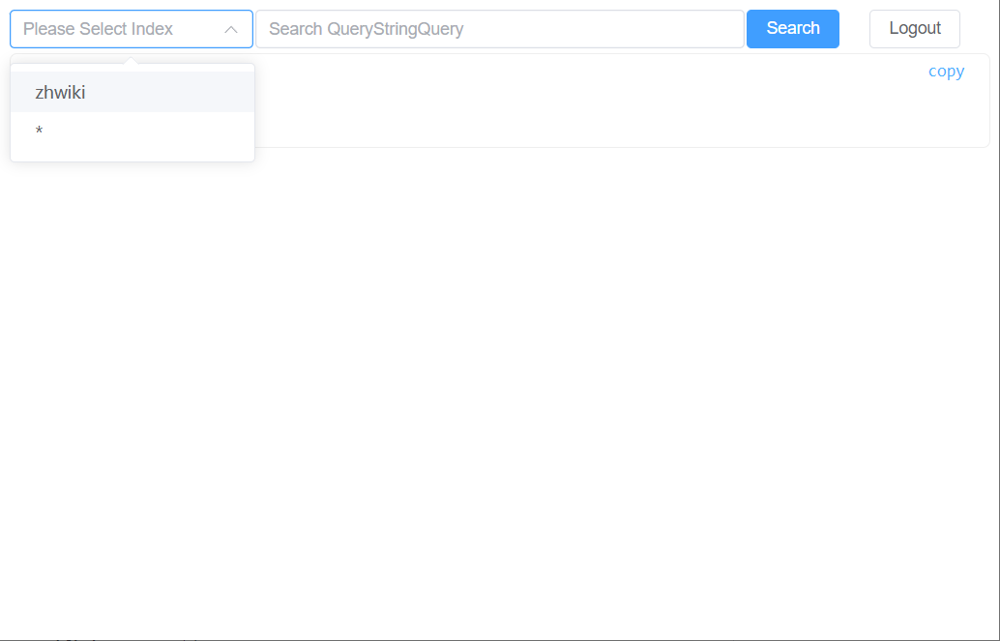
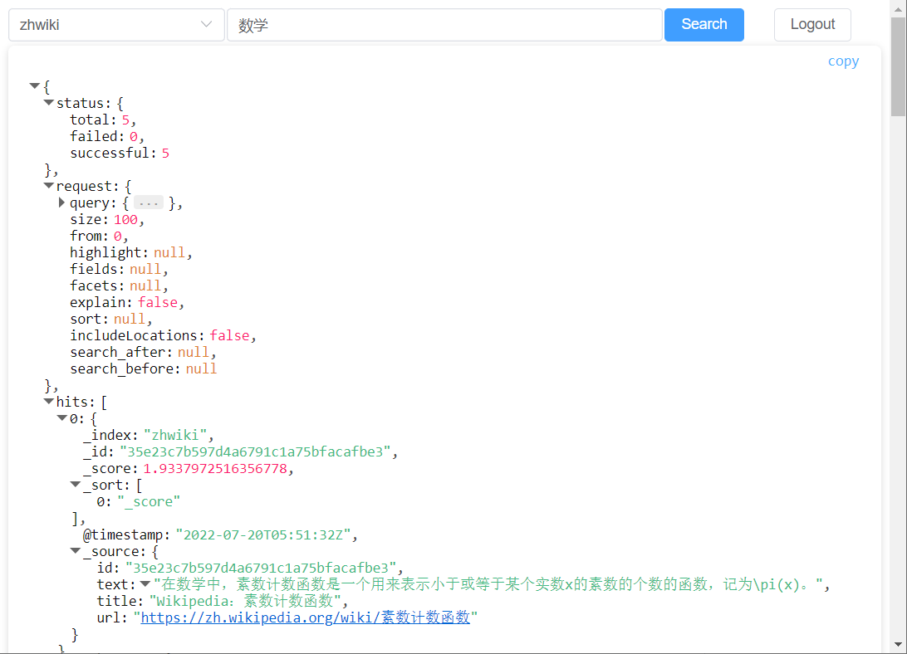

# QuickSearch

## 内容

+ [截屏](#截屏)
+ [简介](#简介)
+ [快速开始](#快速开始)
+ [API参考](#API参考)
+ [从源代码构建/运行](#从源代码构建)
+ [测试](#测试)

### 截屏

**登录**


---
**选择索引(默认为所有索引)**

---
**搜索**


### 简介

Quicksearch是一个以单个二进制文件部署和运行的轻量化搜索引擎，它受到 
[Zinc](https://github.com/zinclabs/zinc) 启发但它使用了 [Bleve](https://github.com/blevesearch/bleve) 
作为底层的索引库并且默认支持中文。它当前只支持本地数据存储。

### 快速开始

如果你安装了 [golang](https://golang.google.cn/learn/) , 只需要运行:

 ```bash
// if go version >= 1.16
go install github.com/feimingxliu/quicksearch/cmd/quicksearch@latest
// or `go get -u github.com/feimingxliu/quicksearch/cmd/quicksearch` for go < 1.16
 ```

这会在你的 `$GOPATH/bin` 生成二进制可执行文件, 注意这样做**并不会安装UI**. 或者可以从 [Releases](https://github.com/feimingxliu/quicksearch/releases) 获取预构建的打包，**它包含UI**.

为了运行Quicksearch，需要复制示例配置：

```bash
wget https://raw.githubusercontent.com/feimingxliu/quicksearch/master/configs/config.yaml
// run quicksearch
quicksearch -c config.yaml
```

或者使用 [Docker](https://docs.docker.com/get-docker/) **(这是推荐做法并且它包含UI)**

```bash
docker run -d -p 9200:9200 feimingxliu/quicksearch
```

Quicksearch的后端服务默认监听在 [:9200](http://localhost:9200) ， 打开 [:9200](http://localhost:9200)
以浏览UI。如果你打开了[config.yaml](configs/config.yaml) 中的`http.auth`，默认情况下使用`admin:admin`登录(用户名:密码)。
直接修改 [config.yaml](configs/config.yaml) 中的`http.auth.username`来修改登录用户名，但是需要这样修改登录密码：

```sh
go run github.com/feimingxliu/quicksearch/cmd/bcrypt -p $YourPassword #这个参数是要设置的密码
```
上面的命令会生成`bcrypt`(一种加密算法)的密码哈希，把它复制到 [config.yaml](configs/config.yaml) 的`http.auth.password`中。
这种情况下, **注意** `http.auth.enabled`必须设置为**true**(否则不会启用登录验证)。

### API参考

#### 索引API

+ *创建索引*

```
POST /<index>
{
    "settings": <Index Settings>,
    "mappings": <Index Mappings>
}
```

请求体可以忽略并将使用默认设置。
`<Index Settings>` 是一个包含索引设置的对象：

```
{
    "number_of_shards": int 
}
```

`<Index Mappings>`是一个包含索引映射的对象

```

{
	"types": {
		"Document Type": <Documnet Mapping>, 
		....
		"Document Type": <Documnet Mapping>
	}
	"default_mapping": <Documnet Mapping>,
	"type_field": string,
	"default_type": string,
	"default_analyzer": string 
}

```

`<Documnet Mapping>` 是一个定义了文档映射的对象：

```

{
	"disabled": bool,	# disable this documnet mapping
	"properties": {
			"name": <Documnet Mapping>,	# this enables nested json
			...
			"name": <Documnet Mapping>
		},
	"fields": <Field Mapping>,
	"default_analyzer": string 
}
```

`<Field Mapping>` 是一个定义了字段级别映射的数组：

```

[
	# you can define one more field mapping for one field, that's why its array {
	"type": string,	# support "keyword", "text", "datetime", "number", "boolean", "geopoint", "IP"
	"analyzer": string,	# specifies the name of the analyzer to use for this field
	"store": bool,	# indicates whether to store field values in the index
	"index": bool	# indicates whether to analyze the field }
]

```

+ *更新索引映射*

```
PUT /<index>/_mapping
<Index Mapping>
```

+ *获取索引详情*

```
GET /<index>
```

+ *打开索引*

```
POST /<index>/_open
```

+ *关闭索引*

```
POST /<index>/_close
```

+ *克隆索引*

```
POST /<index>/_clone/<cloned index>
```

+ *列出索引*

```
GET /_all
```

+ *删除索引*

```
DELETE /<index>
```

#### 文档API

+ *索引文档*

```
POST /<index>/_doc
<document json object>
# or with custom documnet id
POST /<index>/_doc/<docID>
<document json object>
```

如果使用了同一个docID索引一个文档，新文档会完全覆盖旧的文档。

+ *批量操作*

```
POST /_bulk 
POST /<index>/_bulk
<Action Line>
<optional document json object>
......
<Action Line>
<optional document json object>
```

`<Action Line>` 是一个定义了要执行的操作的对象：

```
{ 
	# <Action> can be `create`, `delete`, `index`, `update`
	<Action>: {
		"_index": string,
		"_id": string 
	} 
}
```

+ *更新文档*

```
PUT /<index>/_doc/<docID>
{
	"fieldName": any 
}
```

这个API可以更新文档的部分字段。

+ *获取文档*

```
GET /<index>/_doc/<docID>
```

+ *删除文档*

```
DELETE /<index>/_doc/<docID>
```

#### 搜索API

```
POST /<index>/_search
GET /<index>/_search
POST /_search 
GET /_search 
{ 
	"query": <Query>,
	"size": int,
	"from": int,
	"highlight": []string, # fields to highlight
	"fields": []string,
	"facets": {
		<facet name>: {
            "size": int,
            "field": string,
            "numeric_ranges": [
                {
                    "name": string,
                    "min": float64,
                    "max": float64
                }
            ],
            "date_ranges": [
                {
                    "name": string,
                    "start": datetime, # RFC3339
                    "end": datetime # RFC3339 
                }
            ]
         } 
     },
     "explain": bool,
     "sort": []sting,
     "includeLocations": bool,
     "search_after": []sting,
     "search_before": []string 
}
```

`<Query>` 代表了不同的查询, 详见 [Queries](http://blevesearch.com/docs/Query/).

+ *QueryStringQuery* 是用于搜索的最简单的查询(也是UI中使用的查询)，
  参考 [full query language specification](http://blevesearch.com/docs/Query-String-Query/) 。

```
{
  "query": string,
  "boost": float64 
}
```

+ *TermQuery*

  术语查询是最简单的查询。它在索引中为提供的项执行精确匹配。
大多数情况下，用户应该使用匹配查询。

```
{
  "term": string,
  "field": string
}
```

+ *MatchQuery*

  匹配查询类似于术语查询，但首先分析输入文本。试图使用与字段索引时使用的分析器相同的分析器。
匹配查询可以选择性地执行模糊匹配。如果模糊度参数设置为非零整数，则分析的文本将与指定的模糊度级别匹配。此外，prefix_length参数可用于要求术语也具有指定长度的相同前缀。

```
{
  "match": string,
  "field": string,
  "analyzer": string,
  "boost": float64,
  "prefix_length": int,
  "fuzziness": int,
  "operator": string # "and" or "or"
}
```

+ *PhraseQuery*

  短语查询搜索出现在指定位置和偏移量中的术语。
短语查询为所有短语成分执行精确的术语匹配。如果要分析短语，请考虑使用匹配短语查询。

```
{
  "terms": []string,
  "field": string,
  "boost": float64
}
```

+ *MatchPhraseQuery*

  匹配短语查询与短语查询类似，但会分析输入文本，并使用分析得出的术语构建短语查询。

```
{
  "match_phrase": string,
  "analyzer": string,
  "field": string,
  "boost": float64
}
```

+ *PrefixQuery*

  前缀查询查找包含以提供的前缀开头的术语的文档。

```
{
  "prefix": string,
  "field": string,
  "boost": float64
}
```

+ *FuzzyQuery*

  模糊查询是在指定编辑距离（Levenshtein距离）内匹配术语的术语查询。此外，您还可以选择指定术语必须具有指定长度的匹配前缀。

```
{
  "term": string,
  "field": string,
  "boost": float64,
  "prefix_length": int,
  "fuzziness": int
}
```

+ *ConjunctionQuery*

  连接查询是一个复合查询。结果文档必须满足所有子查询。

```
{
  "conjuncts": []<Query>,
  "boost": 1
}
```

+ *DisjunctionQuery*

  析取查询是一个复合查询。结果文档必须满足可配置的`min`子查询数。默认情况下，此`min`设置为1。

```
{
  "disjuncts": []<Query>,
  "boost": 1,
  "min": 1
}
```

+ *BooleanQuery*

  布尔查询是连接查询和析取查询的有用组合。该查询包含三个查询列表：

    - must - 结果文档必须满足所有这些查询
    - should - 结果文档应至少满足这些查询中的`minShould`
    - must not - 结果文档不能满足任何这些查询

  `minShould` 值是可配置的，默认为0。

```
{
  "must": <Query>, # must be *ConjunctionQuery* or *DisjunctionQuery*
  "should": <Query>, # must be *ConjunctionQuery* or *DisjunctionQuery*
  "must_not": <Query>, # must be *ConjunctionQuery* or *DisjunctionQuery*
  "boost": 1
}
```

+ *NumericRangeQuery*

  数值范围查询查找指定范围内指定字段中包含数值的文档。可以省略一个端点，但不能同时省略两个端点。`inclusiveMin`和`inclusive max`属性控制是否包含或排除端点。

```
{
  "min": float64,
  "max": float64,
  "inclusive_min": bool,
  "inclusive_max": bool,
  "field": string,
  "boost": float64
}
```

+ *DateRangeQuery*

  日期范围查询查找指定范围内指定字段中包含日期值的文档。可以省略一个端点，但不能同时省略两个端点。inclusiveStart和inclusiveEnd属性控制是否包含或排除端点。

```
{
  "start": datetime,
  "end": datetime,
  "inclusive_start": bool,
  "inclusive_end": bool,
  "field": string,
  "boost": float64
}
```

+ *MatchAllQuery*

  查询将匹配索引中的所有文档。

```
{
  "match_all": {},
  "boost": float64
}
```

+ *MatchNoneQuery*

  查询将不匹配索引中的任何文档。

```
{
  "match_none": {},
  "boost": float64
}
```

+ *DocIDQuery*

  文档ID查询将仅匹配包含所提供文档标识符之一的文档。

```
{
  "ids": []string,
  "boost": 1
}
```

### 从源代码构建

为了从源代码运行 `quicksearch` ，首先克隆源仓库。

```sh
git clone --recurse-submodules git@github.com:feimingxliu/quicksearch.git
# or use 'git clone --recurse-submodules https://github.com/feimingxliu/quicksearch.git' if you don't set SSH key.
```

然后下载依赖：

```sh
cd quicksearch && go mod tidy -compat=1.17 # go version >= 1.17
```

构建前端：

```sh
yarn --cwd web/web && yarn --cwd web/web build
```

运行以下命令直接启动 `quicksearch`.

```sh
go run github.com/feimingxliu/quicksearch/cmd/quicksearch -c configs/config.yaml
```

或者像这样构建二进制可执行文件：

```sh
go build -o bin/quicksearch github.com/feimingxliu/quicksearch/cmd/quicksearch
```

运行可执行文件：

```sh
bin/quicksearch -c configs/config.yaml
```

### 测试

测试使用了一些存储在 [git-lfs](https://git-lfs.github.com/) 的测试数据。安装了 [git-lfs](https://git-lfs.github.com/) 之后， 在项目根目录运行

```sh
git lfs pull
```

来获取大的测试文件。

然后运行：

```sh
go run github.com/feimingxliu/quicksearch/cmd/xmltojson
```

上述命令会生成 `test/testdata/zhwiki-20220601-abstract.json`，你可以用编辑器打开它查看内容。

最后，运行以下命令来执行所有测试：

```sh
go test -timeout 0 ./...
```

如果没有任何问题，你将看到输出的最后包含一个`ok`。

### 相关性分数

词 `t` 在文档 `d` 的词频（ `tf` ）是该词在文档中出现次数的平方根。

```
tf(t in d) = √frequency 
```

词在集合所有文档里出现的频率是多少？频次越高，权重 *越低* 。常用词如 `and` 或 `the` 对相关度贡献很少，因为它们在多数文档中都会出现，一些不常见词如 `elastic` 或 `hippopotamus`
可以帮助我们快速缩小范围找到感兴趣的文档。逆向文档频率的计算公式如下：

词 `t` 的逆向文档频率（ `idf` ）是：索引中文档数量除以所有包含该词的文档数，然后求其对数。

```
idf(t) = 1 + log ( numDocs / (docFreq + 1)) 
```

字段的长度是多少？字段越短，字段的权重 *越高* 。如果词出现在类似标题 `title` 这样的字段，要比它出现在内容 `body` 这样的字段中的相关度更高。字段长度的归一值公式如下：

字段长度归一值（ `norm` ）是字段中词数平方根的倒数。

```
norm(d) = 1 / √numTerms 
```

`score(q,d)` 是文档 `d` 与查询 `q` 的相关度评分。

`queryNorm(q)` 是*查询归一化*因子。

`coord(q,d)` 是 *协调* 因子。

查询 `q` 中每个词 `t` 对于文档 `d` 的权重和。

`tf(t in d)` 是词 `t` 在文档 `d` 中的词频。

`idf(t)` 是词 `t` 的逆向文档频率。

`t.getBoost()` 是查询中使用的 *boost*。

`norm(t,d)` 是 字段长度归一值 （如果存在）的和。

```
score(q,d)  =  
            queryNorm(q)  
          · coord(q,d)    
          · ∑ (           
                tf(t in d)   
              · idf(t)²      
              · t.getBoost() 
              · norm(t,d)    
            ) (t in q)    
```

`sumOfSquaredWeights` 是查询里每个词的 IDF 的平方和。

```
queryNorm = 1 / √sumOfSquaredWeights 
```

*协调因子* （ `coord` ）可以为那些查询词包含度高的文档提供奖励，文档里出现的查询词越多，它越有机会成为好的匹配结果。

设想查询 `quick brown fox` ，每个词的权重都是 1.5 。如果没有协调因子，最终评分会是文档里所有词权重的总和。例如：

- 文档里有 `fox` → 评分： 1.5
- 文档里有 `quick fox` → 评分： 3.0
- 文档里有 `quick brown fox` → 评分： 4.5

协调因子将评分与文档里匹配词的数量相乘，然后除以查询里所有词的数量，如果使用协调因子，评分会变成：

- 文档里有 `fox` → 评分： `1.5 * 1 / 3` = 0.5
- 文档里有 `quick fox` → 评分： `3.0 * 2 / 3` = 2.0
- 文档里有 `quick brown fox` → 评分： `4.5 * 3 / 3` = 4.5

协调因子能使包含所有三个词的文档比只包含两个词的文档评分要高出很多。